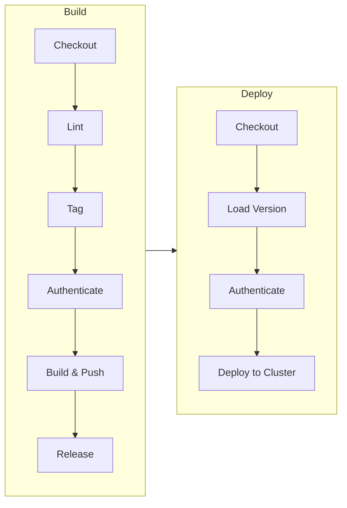

# Usage

## Overview

This repository provides reusable GitHub Actions workflows for building and deploying Helm charts to container registries (GCP Artifact Registry, AWS ECR) and Kubernetes clusters (GKE, EKS).

## Supported Platforms

| Platform | Registry | Cluster | Authentication |
|----------|----------|---------|----------------|
| GCP | Artifact Registry | GKE | Workload Identity Federation |
| AWS | ECR | EKS | IAM Role ARN |

## Workflow Architecture



## Available Workflows

### build.yml

Builds and pushes Helm charts to a container registry.

**Inputs:**

| Input | Type | Required | Default | Description |
|-------|------|----------|---------|-------------|
| `registry` | string | Yes | - | Registry type (`gcp` or `aws`) |
| `region` | string | Yes | - | Cloud region (e.g., `europe-west2`, `eu-west-1`) |
| `repository_name` | string | Yes | - | Registry repository name |
| `workload_identity_provider` | string | No | - | GCP Workload Identity Provider (GCP only) |
| `service_account` | string | No | - | GCP Service Account (GCP only) |
| `gcp_project_id` | string | No | - | GCP project ID (GCP only) |

**Example (GCP):**

```yaml
jobs:
  build:
    permissions:
      contents: write
      id-token: write
    uses: martoc/workflow-helm-chart/.github/workflows/build.yml@v0
    with:
      registry: gcp
      region: europe-west2
      repository_name: helm-charts
      gcp_project_id: my-project
      workload_identity_provider: ${{ vars.WIF_PROVIDER }}
      service_account: ${{ vars.SERVICE_ACCOUNT }}
```

### deploy.yml

Deploys Helm charts to Kubernetes clusters.

**Inputs:**

| Input | Type | Required | Default | Description |
|-------|------|----------|---------|-------------|
| `registry` | string | Yes | - | Registry type (`gcp` or `aws`) |
| `repository_name` | string | Yes | - | Repository name |
| `region` | string | Yes | - | Cloud region |
| `environment` | string | No | - | Environment name (e.g., `dev`, `staging`, `prod`) |
| `cluster_name` | string | Yes | - | Kubernetes cluster name |
| `chart_name` | string | Yes | - | Helm chart name |
| `chart_version` | string | Yes | - | Chart version to deploy |
| `chart_value_file` | string | Yes | - | Path to values file |
| `workload_identity_provider` | string | No | - | GCP WIF provider (GCP only) |
| `service_account` | string | No | - | GCP service account (GCP only) |
| `gcp_project_id` | string | No | - | GCP project ID (GCP only) |
| `aws_role_arn` | string | No | - | AWS IAM role ARN (AWS only) |
| `ref` | string | No | `main` | Git ref to checkout |
| `version` | string | No | - | Version override |

**Example (GCP):**

```yaml
jobs:
  deploy:
    permissions:
      contents: read
      id-token: write
    uses: martoc/workflow-helm-chart/.github/workflows/deploy.yml@v0
    with:
      registry: gcp
      region: europe-west2
      repository_name: helm-charts
      gcp_project_id: my-project
      cluster_name: my-cluster
      chart_name: my-app
      chart_version: "1.0.0"
      chart_value_file: values/production.yaml
      workload_identity_provider: ${{ vars.WIF_PROVIDER }}
      service_account: ${{ vars.SERVICE_ACCOUNT }}
```

**Example (AWS):**

```yaml
jobs:
  deploy:
    permissions:
      contents: read
      id-token: write
    uses: martoc/workflow-helm-chart/.github/workflows/deploy.yml@v0
    with:
      registry: aws
      region: eu-west-1
      repository_name: helm-charts
      cluster_name: my-eks-cluster
      chart_name: my-app
      chart_version: "1.0.0"
      chart_value_file: values/production.yaml
      aws_role_arn: ${{ vars.AWS_ROLE_ARN }}
```

## Environment Protection

The deploy workflow uses GitHub Environments for deployment protection. The environment name is constructed as:

```
{registry}/{environment}/{region}/{cluster_name}
```

For example: `gcp/prod/europe-west2/production-cluster`

Configure environment protection rules in your repository settings to require approvals for production deployments.

## Versioning

The workflows use semantic versioning via the `martoc/action-tag` action. Versions are automatically incremented based on commit messages following conventional commits:

- `feat:` - Minor version bump
- `fix:` - Patch version bump
- `BREAKING CHANGE:` - Major version bump

## Prerequisites

### GCP Setup

1. Create a Workload Identity Pool and Provider
2. Create a Service Account with required permissions:
   - `roles/artifactregistry.writer` for pushing charts
   - `roles/container.developer` for deploying to GKE
3. Configure the trust relationship between GitHub and GCP

### AWS Setup

1. Create an IAM role with trust policy for GitHub Actions
2. Attach policies for:
   - ECR push access
   - EKS cluster access
3. Configure OIDC identity provider in AWS IAM
